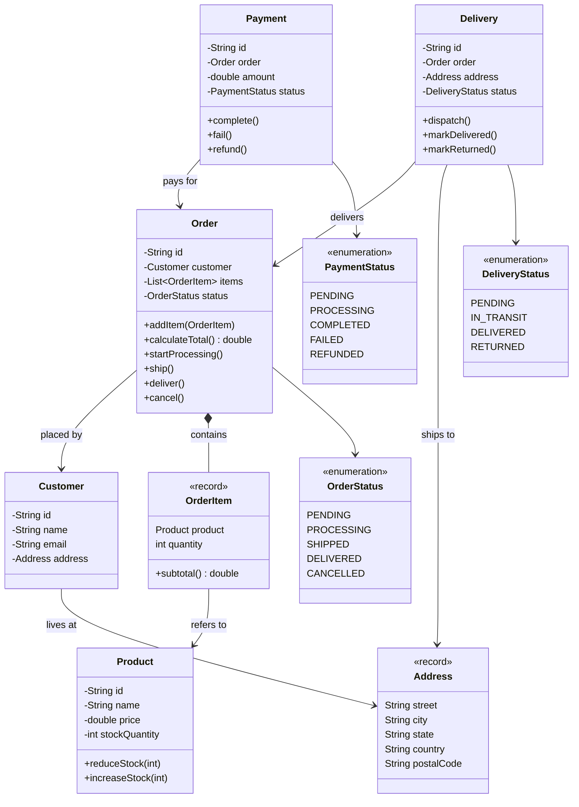

# Domain Model Class Diagram

```mermaid
classDiagram
    class Customer {
        -String id
        -String name
        -String email
        -Address address
    }
    class Product {
        -String id
        -String name
        -double price
        -int stockQuantity
        +reduceStock(int)
        +increaseStock(int)
    }
    class Order {
        -String id
        -Customer customer
        -List~OrderItem~ items
        -OrderStatus status
        +addItem(OrderItem)
        +calculateTotal() double
        +startProcessing()
        +ship()
        +deliver()
        +cancel()
    }
    class OrderItem {
        <<record>>
        Product product
        int quantity
        +subtotal() double
    }
    class Address {
        <<record>>
        String street
        String city
        String state
        String country
        String postalCode
    }
    class Payment {
        -String id
        -Order order
        -double amount
        -PaymentStatus status
        +complete()
        +fail()
        +refund()
    }
    class Delivery {
        -String id
        -Order order
        -Address address
        -DeliveryStatus status
        +dispatch()
        +markDelivered()
        +markReturned()
    }
    class OrderStatus {
        <<enumeration>>
        PENDING
        PROCESSING
        SHIPPED
        DELIVERED
        CANCELLED
    }
    class PaymentStatus {
        <<enumeration>>
        PENDING
        PROCESSING
        COMPLETED
        FAILED
        REFUNDED
    }
    class DeliveryStatus {
        <<enumeration>>
        PENDING
        IN_TRANSIT
        DELIVERED
        RETURNED
    }

    Customer --> Address : lives at
    Order --> Customer : placed by
    Order *-- OrderItem : contains
    OrderItem --> Product : refers to
    Payment --> Order : pays for
    Delivery --> Order : delivers
    Delivery --> Address : ships to
    Order --> OrderStatus
    Payment --> PaymentStatus
    Delivery --> DeliveryStatus
```